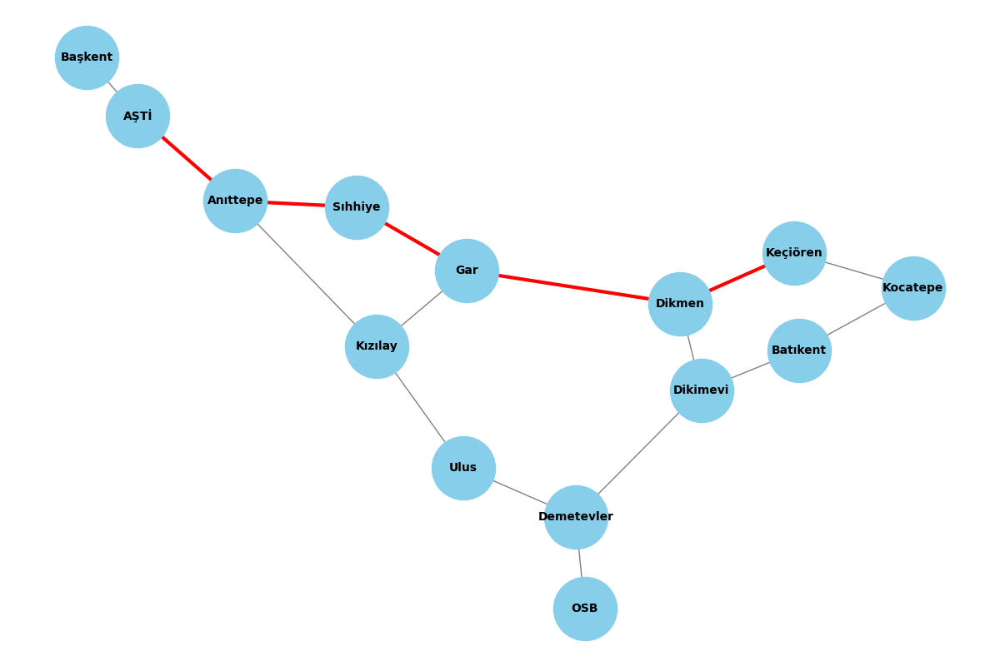
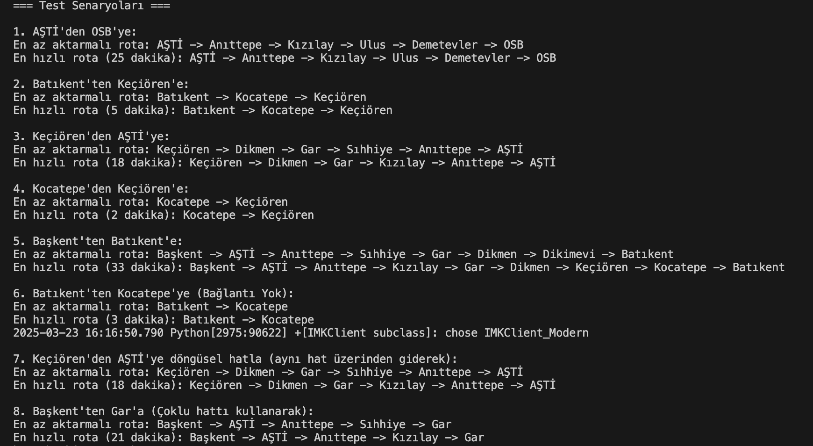

# Sürücüsüz Metro Simülasyonu (Rota Optimizasyonu)

Bu proje, bir metro ağında iki istasyon arasındaki en hızlı ve en az aktarmalı rotayı bulmaya yönelik bir simülasyon geliştirmeyi amaçlıyor. Gerçek dünya problemlerine algoritmik çözümler getirmek için BFS (Breadth-First Search) ve A* algoritmaları kullanıldı. BFS, en az aktarmalı rotayı bulurken, A* algoritması en hızlı rotayı belirliyor.

## Kullanılan Teknolojiler ve Kütüphaneler
Bu projede Python'un aşağıdaki temel kütüphaneleri kullandık:
- **heapq**: A* algoritmasında öncelik kuyruğu yapısı için kullanıldı.
- **collections.deque**: BFS algoritmasında kuyruk yapısı oluşturmak için tercih edildi.

## Algoritmaların Çalışma Mantığı

### BFS (Breadth-First Search) Algoritması:
BFS algoritması, en az aktarmalı rotayı bulmak için kullanılıyor. Bu algoritma, başlangıç istasyonundan hedef istasyonuna kadar olan yolu, her adımda komşu istasyonları keşfederek ve her bir istasyonun ziyaret edilip edilmediğini kontrol ederek buluyor. Bu yöntem, rotada aktarma sayısını minimize etmeye çalışır.

### A* Algoritması:
A* algoritması, en hızlı rotayı bulmak için kullanılıyor. Başlangıç istasyonundan hedef istasyonuna kadar olan yolu, her adımda mevcut toplam süreyi dikkate alarak keşfeder. A* algoritması, her adımda en düşük toplam süreyi hedef alır ve bu sayede hızlı bir çözüm sağlar. Zaman hesabı, her istasyon arasındaki bağlantı sürelerine göre yapılır.

## Algoritmaların Çalışma Mantığı
### 1. En Az Aktarmalı Rota (BFS Algoritması)
BFS algoritması, en kısa yol problemlerinde sıkça kullanılan bir tekniktir. Bu projede, istasyonlar bir graph yapısı olarak modellendi ve BFS ile en az aktarmalı rota hesaplandı. 
- **Adımlar:**
  1. Başlangıç istasyonu kuyruğa eklenir.
  2. Komşu istasyonlar ziyaret edilir ve daha önce gidilmediyse kuyruk yapısına eklenir.
  3. Hedef istasyona ulaşıldığında rota oluşturulur ve döndürülür.

### 2. En Hızlı Rota (A* Algoritması)
A* algoritması, hem mevcut mesafeyi hem de tahmini mesafeyi dikkate alarak en hızlı rotayı bulur. 
- **Adımlar:**
  1. Başlangıç istasyonu öncelik kuyruğuna eklenir.
  2. Her adımda, en kısa süreli olası rota seçilir.
  3. Hedef istasyona ulaşıldığında toplam süre hesaplanarak rota döndürülür.

## Örnek Kullanım ve Test Sonuçları
Aşağıda örnek test senaryolarından bazıları verilmiştir:

**1. AŞTİ'den OSB'ye:**
- En az aktarmalı rota: AŞTİ -> Kızılay -> Ulus -> Demetevler -> OSB
- En hızlı rota: AŞTİ -> Kızılay -> Ulus -> Demetevler -> OSB (25 dakika)

**2. Batıkent'ten Keçiören'e:**
- En az aktarmalı rota: Batıkent -> Demetevler -> Gar -> Keçiören
- En hızlı rota: Batıkent -> Demetevler -> Gar -> Keçiören (21 dakika)

**3. Keçiören'den AŞTİ'ye:**
- En az aktarmalı rota: Keçiören -> Gar -> Sıhhiye -> Kızılay -> AŞTİ
- En hızlı rota: Keçiören -> Gar -> Sıhhiye -> Kızılay -> AŞTİ (19 dakika)

## Projeyi Geliştirme Fikirleri
- Daha geniş bir metro ağı eklemek
- Güzergahları harita üzerinde görselleştirmek
- Kullanıcıdan dinamik olarak başlangıç ve hedef istasyon girmesini sağlamak
- Alternatif algoritmalarla performans karşılaştırması yapmak

Bu proje, algoritmik düşünmeyi geliştirme ve gerçek dünya problemlerine çözümler bulma konusunda önemli bir deneyim sunmaktadır.

 ## Metro Ağı ve Rota Görselleştirme

Projede NetworkX ve Matplotlib kütüphaneleri kullanılarak metro ağının görselleştirilmesi sağlanmıştır. Metro ağı bir grafik olarak modellenmiş ve istasyonlar ile bağlantılar arasındaki ilişkiler görsel hale getirilmiştir. Ayrıca, belirlenen rotalar harita üzerinde farklı renklerle gösterilmektedir.

![Metro Ağı Görselleştirmesi]

![Senaryo çıktı]

